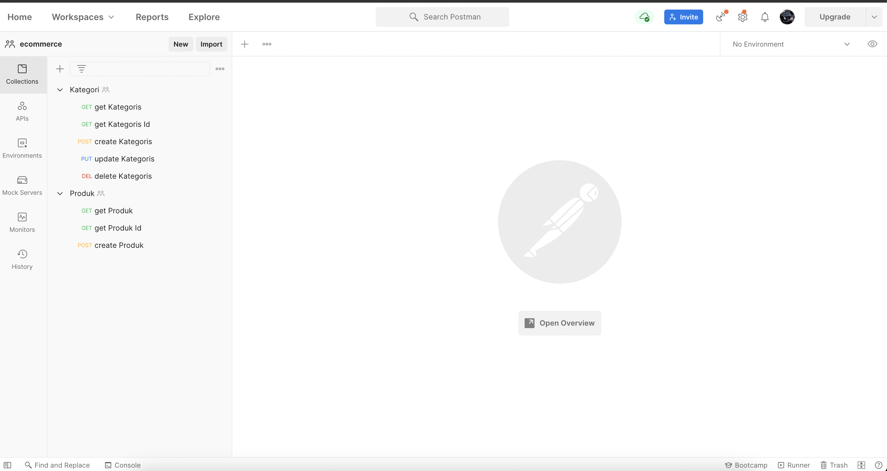

## **API BACK-END ECOMMERCE APPLICATION**

Download ?

git clone (https repository or ssh repository)

How to run ? 
- install maven
- install intellij IDEA
- install java >8 version
- install postman
- xampp

please check you database first and make one database name : ecommerce

by : geetoor maven (Agus Kurniawan)